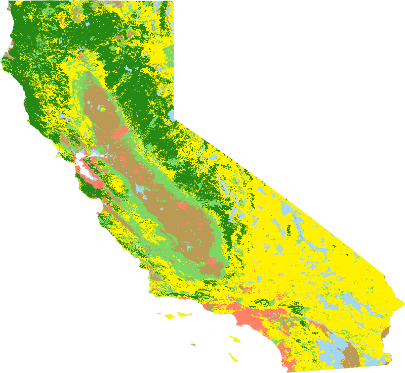

 
## Table of Contents
1. **[Introduction](#introduction)**
2. **[Data](#data)**
3. **[Methods](#methods)**
4. **[Results](#results)**
5. **[Further Work](#furtherWork)**
6. **[Conclusion](#conclusion)**
6. **[References](#references)**

## 1&nbsp;&nbsp;&nbsp;&nbsp;Introduction 

In recent years, wildfires have been growing into a much larger environmental and public safety threat. Fire seasons are larger, more destructive, and burning longer than ever before that the US Forest Service has coined the term “fire year”. The exact causes for this behavior are not known, but scientists point to climate change, increased human activity from expansion into rural areas, and over-zealous fire prevention policies that have created environments ripe for wildfires with large buildups of combustible fire fuels. [1] This phenomenon is happening across the world, but is especially apparent in Northern California, which has historically been a global hotspot for wildfires. The 2018 fire season, the worst in California’s history, was responsible for an estimated $102.6 billion in damages in California. [13] In addition to extensive economic damage, wildfires also pose a significant health hazard by exposing millions of people along the West Coast to harmful aerosol pollutants, such as ash and dust. Our preliminary analysis also confirms that wildfires are more frequent and destructive. From 1990-2020 there has been a 267% increase in the number of fires annually and in the past 20 years there has been a 520% increase in the number of fire seasons that exceed 500,000 burned acres compared to the 50 years prior.
<figure class="image" align="center">
  
  <figcaption align="center">Firefigher battles the 2020 Creek Fire </figcaption>
</figure>

## 1.1&nbsp;&nbsp;&nbsp;&nbsp;What is Burn Severity?

To clarify on the meaning and usage of wildfire jargon, fire intensity is strictly used to describe the total amount of energy released by a fire, while fire or burn severity describe the effect of fire on aboveground and belowground biomass. This includes measures like canopy cover, crown volume, surface litter, and soil hydrophobicity. These terms are often used interchangeably, but a minor distinction is that in certain applications burn severity can specifically refer to fire effects on soil. [2] Our analysis uses remote sensing data to specifically measure the effect of wildfire on above and belowground biomass, which we refer to interchangeably as fire or burn severity. This definition is widely used by federal fire mapping groups and past research on wildfires.

Burn severity maps are widely used by federal agencies and forest managers to map fire damage and extent, prioritize forest recovery efforts, update vegetation and land cover maps, monitor ecosystem health, and assess the risks of any downstream impacts in the future. Fire mapping responsibilities are shared by several federal interagency groups, mainly Monitoring Trends in Burn Severity ([MTBS](https://mtbs.gov/)), Rapid Assessment of Vegetation Condition after Wildfire ([RAVG](https://burnseverity.cr.usgs.gov/ravg/)), and Burned Area Emergency Response ([BAER](https://burnseverity.cr.usgs.gov/baer/baer/home)).

<figure class="image" align="center">
  
  <figcaption align="center">Burn severity map of 2017 Buck Fire by MTBS</figcaption>
</figure>

Traditional methods of producing these maps are expensive and time-consuming since they require teams of surveyors and ecologists to gather in-situ data. For many fires, this is infeasible due to harsh terrain and weather. These methods are still used for certain fires, but have been largely phased out with the introduction of remotely sensed data from Earth observing satellites. Fires can be mapped at a much faster and larger scale at a fraction of the cost relative to field surveys, while still maintaining high accuracy. Remote sensing data is widely used in many other applications, such as agriculture, climate change, and natural disasters, since they cover long time spans and are continuously updated with high resolution, multi-spectral data.

## 1.2&nbsp;&nbsp;&nbsp;&nbsp;Normalized Burn Ratio (NBR)

The most widespread spectral index for identifying burned areas and fire severity levels is the Normalized Burn Ratio, NBR =(NIR - SWIR)(NIR + SWIR)=(Band 5 - Band 7)(Band 5 + Band 7) 

NBR = (NIR-SWIR)(NIR+SWIR) and with Landsat this is NBR = (Band 5 - Band 7)(Band 5 + Band 7).

The near-infrared band (NIR) is sensitive to chlorophyll present in live vegetation, while the short-wave infrared band (SWIR) is primarily sensitive to water content in soil and vegetation. It has also been shown to be capable of discerning dead wood from burned soil, ash, and charred wood. As a result, NBR is sensitive to live, photosynthetically active vegetation, moisture content, and certain post-fire surface conditions. [3]

<figure class="image" align="center">
  
  <figcaption align="center">Reflectance of NIR, SWIR for burned and unburned areas </figcaption>
</figure>

To produce a burn severity map, optimal pre and post fire images are selected based on their proximity to a fire and the presence of environmental factors that reduce image quality, like clouds, smoke, and snow.
NBR is computed for pre and post fire images and their results are differenced (dNBR). A set of thresholds corresponding to different burn severities is then applied to produce a burn severity map. Federal fire-mapping groups mainly use this approach, but with slight differences based on their organizational needs.

A weakness of using dNBR is that it tends to underestimate burn severity in regions that are less vegetated or are covered with shrubs and grasslands. For example in the figure below, forest A has half the pre-fire vegetation of forest B and C. Forest A and B both experience almost total vegetation loss from a fire and should both be classified as experiencing a high severity burn. Forest C also has a fire and loses about half of its trees and should be classified as a moderate severity burn. However since Forest A has less pre-fire vegetation than Forest B, its dNBR value is much lower and about the same as Forest C’s dNBR value. This implies that the burn severity classification of Forest A and C would be the same, even though Forest A has the same post-fire state as Forest B. 

<figure class="image" align="center">
  
  <figcaption align="center">Figure 2: Scenario where dNBR thresholding underestimates burn severity [3]</figcaption>
</figure>

This leads to an underestimate of burn severity that skews the results of fire severity maps. A relativized version of dNBR, rdNBR, has been shown to perform better in regions that are less vegetated and have mixed vegetation types, but it isn’t as commonly used.[3]

## 1.3&nbsp;&nbsp;&nbsp;&nbsp;Federal Fire Mapping Groups
1.2   Federal Fire Mapping Groups
The main groups responsible for mapping fires in the US are MTBS, RAVG, and BAER. MTBS is the largest and most active federal mapping group and in California it maps fires larger than 5000 acres. RAVG maps fires that occur on at least 1000 acres of National Forest System (NFS) land and produces results usually within 60 days of fire containment. It specifically focuses on changes in canopy cover and basal area. BAER is slightly different since its main goal is to assess soil burn severity and identify and prescribe treatments for any hazards caused by fire, like water runoff from hydrophobic soil. Within a week of a fire’s containment it provides satellite imagery and preliminary burn severity data to field teams, made up of ecologists, soil scientists, and engineers, that work in the field to stabilize a region. [7]

Several issues currently hinder the effectiveness of burn severity maps produced by these groups. Due to various agency requirements, lack of resources, and the immense number of wildfires every year, federal agencies are only able to map a fraction of wildfires. This leads to lacking fire documentation and coverage, which could limit the work of groups that depend on fire severity maps. In addition there is a lack of “completeness” in the data used to produce fire severity maps. Only two spectral bands, NIR and SWIR, are used from Landsat to calculate dNBR and contextual data, like land cover or weather aren’t used. This additional data could contain relevant information that can be uncovered with machine learning.

The second issue relates to the consistency of severity maps. Maps produced by MTBS rely on analysts to subjectively determine dNBR thresholds to produce severity classifications. These thresholds are not validated with field data or ecologically quantified so the consistency of their maps is questionable. [7] 
Another source of inconsistency is the use of different pre and post fire images since these agencies operate separately and on different timelines. Ideally, the selected pre-post fire images are as close to a fire as possible because using images that are further apart can influence results. For example, selecting a post fire image from a later date allows vegetation regrowth from fire or seasonal changes in vegetation to occur. Or if a fire occurs in November but a pre-fire image from spring is used, this can increase a fire’s dNBR value since the absolute decrease in vegetation is greater. [8] For these reasons, agencies often come up with conflicting results. Figures 3a-b demonstrate this issue with the 2013 Rim Fire near Yosemite National Park.

<figure class="image" align="center">

  

    
  

  

    
  

	<figcaption align="center">RAVG and BAER severity maps for 2013 Rim Fire </figcaption>
</figure>

The third issue, which only affects MTBS, is the speed at which severity maps are produced. They release maps on a two year lag and as of today still have not released any for fires from the 2020 and 2021 fire seasons. This delay is likely due to the large number of fires they are responsible for and the amount of human influence required. 

## 1.4&nbsp;&nbsp;&nbsp;&nbsp;Related Research
Fire severity is a well researched topic and common approaches revolve around in-situ sampling and spectral indices derived from image algebra, similar to other change detection applications.[9] In recent years machine learning applications for remote sensing have been growing in popularity, but are still fairly limited. This has been attributed to the limited support of machine learning methods in traditional remote sensing software, confusion on how to apply ML models, contradictory model performance, and parametric methods still being extremely popular even though they have been shown to perform worse overall. [4][10] Machine learning models perform well at modeling complex relationships between features and benefits from large, high-dimensional datasets, which are common with remote sensing datasets.

Given these benefits, we propose the use of machine learning methods with remote sensing data to map fire severity. This would address the issues highlighted above and reduce human subjectivity, allow maps to be produced at a faster and larger scale, and allow us to incorporate additional spectral bands along with contextual data including weather, land cover, and terrain. We plan to train our models using data sampled from 17 wildfires in Northern California and evaluate their performance on other wildfires in the region. A study similar in scope to ours was conducted by training a random forest classifier (RF) over in-situ and remote sensing data from 8 fires in Victoria, Australia. They found that RF generally produced more accurate burn severity results than a traditional spectral indexing approach. [5]

## 1.5&nbsp;&nbsp;&nbsp;&nbsp;Region of Interest
Our study will be focused on Northern California since it is a global hotspot for wildfires that has affected a majority of students at UCSD. In addition, its infamous wildfires are well documented by CALFIRE, have been researched significantly in the past, and there are many remote sensing datasets that cover this region.

<figure class="image" align="center">
  
  <figcaption align="center">Figure 4: California Land Cover (2016)</figcaption>
</figure>

A majority of counties in Northern California are very rural, have sparse populations, and are mostly undeveloped. Their land covers are largely dominated by conifer forests, low-lying shrubland, annual grassland, and mixed chaparral. These vegetation types are known to be conducive to wildfires as some chaparral species release flammable resins that help it propagate its seeds during wildfires. Conifer trees also produce lots of surface litter and tree sap that are easily combustible. These counties account for a majority of wildfires and related damages. Counties located in Central California near Sacramento, like Yolo, Sutter, and San Joaquin, are more developed and revolve around agriculture and livestock. On average these counties experience less than 2 wildfires per year, usually under 1000 acres.

Northern California is historically prone to wildfire since it doesn’t experience much rainfall and has dry, hot summers that lead to large accumulations of combustible fire fuels in the fall. Environmental factors, like strong downslope winds and lightning strikes, and human activity are common wildfire ignition sources. [1] California is especially susceptible to long droughts and often experiences consecutive dry years, which are characteristic of regions with Mediterranean type climates. As the effects of climate change become more apparent, droughts and wildfires in California will be a greater environmental and public safety hazard. 

## 2&nbsp;&nbsp;&nbsp;&nbsp;Data 

Google Earth Engine ([GEE](https://earthengine.google.com/)) is a cloud-based distributed computing environment that greatly reduces the technical barriers to entry for large scale geospatial analysis and hosts a large catalog of data including satellite imagery, climate forecasts, and geophysical data.[6] We used the GEE platform to access and run computations on remote sensing data from Landsat 8, NASA SRTM, NLCD 2016, and GRIDMET.

| Data | Provider | Bands |
| ---- | ----- | ---- |
| [Landsat 8 (Level 2, Collection 2, Tier 1)](https://developers.google.com/earth-engine/datasets/catalog/LANDSAT_LC08_C02_T1_L2) | USGS | 7 |
| [NASA SRTM Digital Elevation](https://developers.google.com/earth-engine/datasets/catalog/USGS_SRTMGL1_003?hl=en) |	NASA / USGS / JPL-Caltech | 1 |
| [NLCD: USGS National Land Cover Database (2016)](https://developers.google.com/earth-engine/datasets/catalog/USGS_NLCD_RELEASES_2016_REL?hl=en) | USGS | 14 |
| [GRIDMET: University of Idaho Gridded Surface Meteorological Dataset](https://developers.google.com/earth-engine/datasets/catalog/IDAHO_EPSCOR_GRIDMET) |	University of California: Merced | 16 |

Data on California wildfire seasons from 1950-2020 is provided by [CALFIRE](https://gis.data.ca.gov/datasets/CALFIRE-Forestry::california-fire-perimeters-1950/explore) and includes information on a fire’s location, geometry, size, and duration.

## 2.1&nbsp;&nbsp;&nbsp;&nbsp;Fire and Image Selection
In total, 17 fires were selected from a candidate set of 79 fires. The fires occurred across Northern California between 2013-2020 because this coincides with the launch of Landsat 8 (February 2013) and the California wildfire dataset doesn’t include any fires past the 2020 fire season. All selected fires are at least 10,000 acres in size because fires of this size are better documented and have more pixels to sample. Our selection criteria was to get a representatative sample of fires in Northern California based on size, location, time of year, and land cover type. This improves the robustness and generalizability of our models to fires in different conditions.
<figure class="image" align="center">

  

    
  

  

    
  

	<figcaption align="center">Location and data of 17 selected fires </figcaption>
</figure>

To get optimal pre and post fire images from Landsat 8, we considered all images that occurred 60 days before and after a fire. Images were selected based on the presence of environmental factors that reduce image quality, including clouds, smoke, and snow,
and their proximity to a fire’s start or end. A majority of pre-fire images are within 14 days of a fire’s ignition, but some post-fire images occur much later due to poor image quality.

#### [[+] Selection Details](./md/fireImageDetails.md)

## 2.3&nbsp;&nbsp;&nbsp;&nbsp;Data Extraction
In addition to surface reflectance data from [Landsat 8 (Level 2, Collection 2, Tier 1)](https://developers.google.com/earth-engine/datasets/catalog/LANDSAT_LC08_C02_T1_L2), we also used land cover, elevation, and weather data from [NLCD](https://www.mrlc.gov/), [NASA SRTM](https://developers.google.com/earth-engine/datasets/catalog/USGS_SRTMGL1_003?hl=en), and [gridMET](https://developers.google.com/earth-engine/datasets/catalog/IDAHO_EPSCOR_GRIDMET?hl=en) respectively. These images are clipped over each fire’s bounding box and their bands are merged into a single image in GEE. The selected Landsat 8 images are pre-orthorectified to account for terrain and we used the standard image differencing method to calculate dNBR.

Using proposed burn severity values from the USGS, which we simplified from seven classes to five, we classified each pixel as either vegetation growth, unburned, low severity burn, moderate severity burn, and high severity burn. [2] We simplified the land cover classes used by the NLCD  and remapped  them to six classes: developed, forest, shrub, grassland, agriculture, and other. Pixels that are marked as bodies of water, perennial snow, barren rock, or wetlands are reclassified as “other”. This makes our data easier to interpret and removes redundant land cover classes that aren’t present in Northern California. Rasters for each fire are extracted from GEE with varying cell size (30m - 90m) based on fire size. Variable cell sizes serve as a soft regularization technique to even out the number of data points between larger and smaller fires. Increasing the cell size for large wildfires was crucial for staying within memory resources. The model interpretability does not suffer much between fire sizes since the cell size of feature datasets are larger.

## 3&nbsp;&nbsp;&nbsp;&nbsp;Methods 

## 3.1&nbsp;&nbsp;&nbsp;&nbsp;Feature Selection and Engineering 
Feature selection was performed by keeping all features with coefficients greater than 0.02in a fitted Logistic Regression model. The most important features were NDVI, elevation, Landsat 8 Bands 1-7, land cover, and tree cover percentage. Our simplified land cover classes are one hot encoded and all the features were standardized to prevent one feature’s variance from dominating the other features in the dataset. To train and validate our models, we randomly split our sampled wildfire data to 80% training data and 20% testing data. 

## 3.2&nbsp;&nbsp;&nbsp;&nbsp;Models

### Logistic Regression
Our Logistic Regression model had an accuracy of around 80% when tested on our test data. This model performed the best in predicting unburned areas with an accuracy of around 84%. On the other hand, this model had the worst accuracy (~58%) in predicting low burn severity areas. One limitation of this model is that it assumes linearity between the features and the target classes.

### Mutli-Layer Perceptron Classifier
The Multi-Layer Perceptron Classifier model has a major advantage in that it can learn non-linear relationships in data. This model produced an accuracy of around 86%, slightly better than the Logistic Regression model. This model performed the best in predicting unburned areas with an accuracy of around 90% while it had the worst accuracy (66%) in predicting high burn severity areas. 

### Random Forest Classifier
The Random Forest Classifier consistently has an accuracy of about 85% without any parameter tuning. This performance is expected since previous studies have shown that Random Forests perform well without any parameter tuning and do not overfit to training data as the number of trees and leaves increase. [11] [12]

Similar to our Logistic Regression model, our Random Forest Classifier model performed the best in predicting unburned areas with an accuracy of around 92%. This model has the worst accuracy in predicting low burn severity and high burn severity areas which both had an average burn severity of 77%. Overall, this model had the most consistent accuracy results across all target classes. 

### Support Vector Classifier
Support Vector machines were a good candidate due to its strength in geospatial applications and generalization qualities. This model’s performance was especially sensitive to seasonality

### Logit Boost/Adaboost
Boosting methods have been shown to be effective in modeling fire severity. Each model is a variation of boosted trees with different loss functions. These models were not as robust as the bagging methods and tended to overpredict the burned perimeter more often than other methods. 

## 4&nbsp;&nbsp;&nbsp;&nbsp;Results 

To evaluate how generalizable our models are to other Northern California wildfires, we benchmarked their performances on fires of varying sizes, times of year, and land cover types. These factors can affect fire behavior and produce inaccurate or skewed model results. We selected 5 fires that represent these different factors to demonstrate the strength and weaknesses of our models. 

| Fire | Start | End | Acres | County | Land Cover
| ---- | ----- | ---- | ---- | ---- | ----- | ---- |
| Abney | 2017-08-10 | 2018-01-10 | 32893 | Siskiyou | Forest |
| Atlas | 2017-10-08 | 2017-11-01 | 51624 | Napa | Mixed 
| Slink | 2020-08-29 | 2020-11-13 | 26751 | Alpine | Mixed |
| Steele | 2017-07-26 | 2017-08-13 | 45704 | Modoc | Shrub | 

We tested our models’ performance on several small wildfires. Most fires in Northern California are under 10,000 acres in size, but the fires we selected to train our models on are all above this size. This led to some concerns on if our models would be able to accurately map these smaller fires. The Slink and Abney Fires are used to demonstrate how the effects of winter pose a significant challenge to our models and offer directions for further improvement. We selected the Atlas and Steele Fire to test how our models perform in mixed and heterogeneous shrubland environments. These land cover types are known to be difficult to map with linear dNBR thresholding and often require human subjectivity in setting thresholds. We show that our models are robust to these conditions and can produce accurate burn severity maps.

In general, our models perform best on fires in non-winter months that have forested or mixed land cover types. With fires in these ideal conditions, our models are able to accurately identify the shape of a fire and classify unburned areas with up to 90% recall and precision. In ecosystems that are mostly shrub and grassland, our models produce mixed results and are capable of identifying fire scars, but are also prone to underfitting burn severities. Since our approach only requires post-fire data, our models are more robust to noise from seasonal vegetation loss and less sensitive to snow in post fire images. One of the weaknesses of our models is that they can struggle to identify pixels with vegetation growth and high severity burns. This is likely due to pixels with these classes not occurring frequently in our training data. Another issue is that our models tend to misclassify burned pixels as being unburned, which leads to some predicted burn severity maps being sparse and discontinuous. 

## 4.1&nbsp;&nbsp;&nbsp;&nbsp;Different Sized Fires
We found that the size of a fire did not affect the performance of our models, despite not having any training data from fires below 10,000 acres. This possibly suggests that the behavior of small fires doesn’t vary much from bigger fires and could be a direction for further research. Other factors related to seasonal changes and land cover type are found to be very influential in model performance for fires of all sizes.
This is demonstrated well with the Carr Fire (2018).

## 4.3&nbsp;&nbsp;&nbsp;&nbsp;Season
We found that seasonal changes in vegetation and the presence of snow were a major roadblock to producing burn severity maps for fires in winter months with either method. For example we tested our models on the Slink Fire (2020) which burned in the Sierra Nevadas late into the fire season. As a result, the candidate set of post-fire images are strongly affected by snow and seasonal vegetation loss.  The fire scar is fairly visible in Figure 7b, but is partly obscured by snow, which is blue in the false color image, in the central part of the fire and in the surrounding region. 

<figure class="image" align="center">

  

    
  

  

    
  

  

    
  

  

    
  

	<figcaption align="center">Slink </figcaption>
</figure>

An issue with the thresholded map in Figure 7c is that there are many pixels classified as vegetation growth, mostly near regions with snow. In the top right corner of the images is agricultural land that is unburned by the Slink FIre. However due to crop harvesting or seasonal changes in winter, this area has less vegetation postfire. As a result, the linear dNBR threshold picks up on this and misclassifies these pixels as low severity burns in Figure 7c. These issues contribute a lot of noise to the burn severity map and can make it more difficult to interpret a fire’s burn severity. As demonstrated with our MLP classifier in Figure 7d, our models are not as sensitive to these factors and are able to produce a clear burn severity map that better shows the fires outline.

For fires with heavier snow coverage and seasonal vegetation loss, our models really broke down and produced inaccurate results. This was very apparent when we tested our Logistic Classifier on the Abney Fire (2017). In Figure 8b, the fire scar isn’t really visible and large amounts of snow obscure much of the image.

<figure class="image" align="center">

  

    
  

  

    
  

  

    
  

  

    
  

	<figcaption align="center">Abney</figcaption>
</figure>

An issue that stands out with both burn severity maps is that they’re very noisy and don’t show an identifiable outline of the Abney Fire. This is likely due to winter vegetation loss being misidentified as burned vegetation. Unlike our other models, the Logistic Classifier was a lot more sensitive to this noise and also identified snow as a moderate severity burn. 

In general our models perform better than linear thresholds for fires that don’t have heavy snow coverage or vegetation loss. With the Slink Fire (2020), they correctly identify pixels with snow as unburned areas and produce a clearer burn severity map. 
Our models struggle with fires that have more snow and produce inaccurate results, which is likely because our training fires are absent of snow and occur mostly in late summer and fall. Accounting for the issues posed by winter fires could be a direction for further model tuning and improvement.

## 4.4&nbsp;&nbsp;&nbsp;&nbsp;Land Cover
Our model performed well on fires of mixed land covers that occur most frequently in Napa and Sonoma counties. These fires can be difficult to produce burn severity maps for because discrete severity thresholds may not accurately represent how fires behave in different land covers. We tested our models on the Atlas Fire (2017) as it is adjacent to Napa, CA and has a very mixed land cover composition with lots of agricultural and urban areas. 

<figure class="image" align="center">

  

    
  

  

    
  

  

    
  

  

    
  

	<figcaption align="center">Atlas</figcaption>
</figure>

Using our MLP classifier we are able to produce a map that accurately identifies burned and unburned regions and shows the shape of the Atlas Fire. A key difference is that the map produced by the MLP classifier shows the Atlas Fire as having a significantly more severe burn compared to the linear threshold method. This is likely a more accurate assessment of the Atlas Fire as dNBR thresholding is known to underestimate burn severities in shrub and grassland. [3] A strength of using our models in environments with mixed land covers is that they are robust to changes in agricultural regions from crop sowing and harvesting. The linear threshold picks up on these changes and classifies many pixels on unburned farmland as having a low severity burn or vegetation growth, which adds a lot more noise.

We also tested our models on the Steele Fire (2017) which occurs in Modoc County, a part of California that is mostly covered by shrubland. As mentioned with the Atlas Fire, dNBR thresholding struggles to produce accurate burn severity classifications for fires in shrubland and other less vegetated regions. A quick solution around this issue, that is employed by MTBS, is to have analysts subjectively determine severity thresholds. However this approach introduces a lot of human influence, produces inconsistent results, and is time-consuming.

<figure class="image" align="center">

  

    
  

  

    
  

  

    
  

  

    
  

	<figcaption align="center">Steele</figcaption>
</figure>

The burn severity map in Figure 10c demonstrates this issue as a large majority of pixels are classified as unburned. In contrast, the map produced with a Random Forest classifier in Figure 10d shows that it is much more capable of identifying burned areas and depicting the fire’s outline. Our training data did not include many fires that occurred in shrubland dominant ecosystems, so with further model training this result could likely be improved.

## 5&nbsp;&nbsp;&nbsp;&nbsp;Further Work 

A common issue our models experienced was misidentifying burned pixels as unburned and this was especially noticeable for fires in shrub and grassland ecosystems. This likely occurs because our models are trained on burn severity values generated using dNBR thresholding. Having models trained on burn severity values generated using rdNBR thresholding instead for fires in these regions could be a workaround solution. Another solution would be incorporating more training data from a wider set of wildfires in shrub and grassland environments. This could improve the overall generalizability of our models in these environments

We decided to use surface reflectance data from Landsat 8 over alternative options, such as Sentinel-2, because it’s also used by federal fire mapping agencies, has the same spatial resolution (30m) as our other data, and has been operating for longer, especially if previous Landsat satellites are considered. However there are several benefits that Sentinel-2 provides that make it an attractive option to explore. 

The first is that since Sentinel-2 is composed of two satellites that orbit in tandem, it has a much shorter revisit time of 5 days compared to a revisit time of 16 days for Landsat 8. This means that for a given timespan there is a much larger set of post-fire images to use and that burn severity maps can be produced faster. Sentinel-2 also provides four bands that are dedicated to the red edge wavelength range. Reflectance in this part of the electromagnetic spectrum is highly sensitive to chlorophyll content in vegetation and is indicative of vegetation health. The addition of these bands is likely helpful for  distinguishing between seasonal vegetation change and burned vegetation. Another small benefit of using Sentinel-2 is that most of its bands have a spatial resolution of 10-20m, compared to 30m for Landsat 8. This is helpful for working with small fires and producing more granular burn severity maps.

## 6&nbsp;&nbsp;&nbsp;&nbsp;Conclusion 
In this paper, we outline several issues with current fire mapping methods used by federal agencies that lead to inefficient, inconsistent, and incomplete results. Using data collected from Northern Californian wildfires, we demonstrate how supervised machine learning classifiers can be a viable alternative to current mapping methods. Our models work best for fires in non-winter months that occur in forested or mixed land cover environments and are able to accurately identify unburned areas and map burn severities. Our work serves as a strong starting point for further research on mapping and analyzing wildfires with machine learning.

## 7&nbsp;&nbsp;&nbsp;&nbsp;References 
1. **[Observed Impacts of Anthropogenic Climate Change on Wildfire in California](https://agupubs.onlinelibrary.wiley.com/doi/full/10.1029/2019EF001210) (2019)**
2. **[Fire intensity, fire severity and burn severity: a brief review and suggested usage](https://www.researchgate.net/publication/228638145_Fire_intensity_fire_severity_and_burn_severity_A_brief_review_and_suggested_usage) (2009)**
3. **[Quantifying burn severity in a heterogeneous landscape with a relative version of the delta Normalized Burn Ratio (dNBR)](https://www.sciencedirect.com/science/article/pii/S0034425706005128?casa_token=kAVX-fKLGFoAAAAA:xUl-ItGFtyyMcXyTnM0nM1oufPGbhbbFzUfo3fYQ36NU9bO7hIqSDWRMR-ifOMreyaUfn8hzDKk) (2006)**
4. **[Implementation of machine-learning classification in remote sensing: an applied review](https://www.tandfonline.com/doi/full/10.1080/01431161.2018.1433343) (2017)**
5. **[Fire-severity classification across temperate Australian forests: random forests versus spectral index thresholding](https://www.researchgate.net/publication/336659069_Fire-severity_classification_across_temperate_Australian_forests_random_forests_versus_spectral_index_thresholding) (2019)**
6. **[Google Earth Engine: Planetary-scale geospatial analysis for everyone](https://www.sciencedirect.com/science/article/pii/S0034425717302900) (2017)**
7. **[Limitations and utilisation of Monitoring Trends in Burn Severity products for assessing wildfire severity in the USA](http://www.pyrogeographer.com/uploads/1/6/4/8/16481944/kolden_etal_mtbs.pdf) (2015)**
8. **[Digital change detection techniques using remotely-sensed data](https://www.tandfonline.com/doi/pdf/10.1080/01431168908903939) (1989)**
9. **[Classifying and Mapping Wildfire Severity] (https://www.ingentaconnect.com/content/asprs/pers/2005/00000071/00000011/art00006#) (2005)**
10. **[Meta-discoveries from a synthesis of satellite-based land-cover mapping research](https://www.tandfonline.com/doi/full/10.1080/01431161.2014.930206) (2014)**
11. **[Random forest classifier for remote sensing classification](https://www.tandfonline.com/doi/full/10.1080/01431160412331269698) (2005)**
12. **[Random forest in remote sensing: A review of applications and future directions](https://www.sciencedirect.com/science/article/pii/S0924271616000265?casa_token=B3S6Acn8XpcAAAAA:PkRUhramLKWbK-GkOsEDYJwO-Ueq0oqiMnT7H_w8s1-IhnpwxdbLWhUpZz4_ghDBRFN4XC6BzCI) (2016)**
13. **[Economic footprint of California wildfires in 2018](https://www.nature.com/articles/s41893-020-00646-7#citeas) (2020)**
