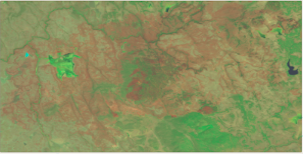

 
## Table of Contents
1. **[Introduction](#introduction)**
2. **[Data](#data)**
3. **[Methods](#methods)**
4. **[Results](#results)**
5. **[Discussion](#discussion)**
6. **[References](#references)**

## 1&nbsp;&nbsp;&nbsp;&nbsp;Introduction 

In recent years, wildfires have been growing into a much larger environmental and public safety threat. Fire seasons are larger, more destructive, and burning longer than ever before such that the US Forest Service has coined the term “fire year”. The exact causes for this behavior are not known, but scientists point to climate change, increased human activity from expansion into rural areas, and over-zealous fire prevention policies that have created environments ripe for wildfires with large buildups of combustible fire fuels. [1] This phenomenon is happening across the world, but is especially apparent in Northern California, which has historically been a global hotspot for wildfires. The 2018 fire season, the worst in California’s history, was responsible for an estimated $102.6 billion in damages in California. [13] In addition to extensive economic damage, wildfires also pose a significant health hazard by exposing millions of people along the West Coast to harmful aerosol pollutants, such as ash and dust. Our preliminary analysis also confirms that wildfires are more frequent and destructive. From 1990-2020 there has been a 267% increase in the number of fires annually and in the past 20 years there has been a 520% increase in the number of fire seasons that exceed 500,000 burned acres compared to the 50 years prior.

<figure class="image" align="center">
  
  <figcaption align="center">Firefigher battles the 2020 Creek Fire </figcaption>
</figure>

## 1.1&nbsp;&nbsp;&nbsp;&nbsp;What is Burn Severity?

To clarify on the meaning and usage of wildfire jargon, fire intensity is strictly used to describe the total amount of energy released by a fire, while fire or burn severity describe the effect of fire on aboveground and belowground biomass. This includes measures like canopy cover, crown volume, surface litter, and soil hydrophobicity. These terms are often used interchangeably, but a minor distinction is that in certain applications burn severity can specifically refer to fire effects on soil. [2] Our analysis uses remote sensing data to specifically measure the effect of wildfire on above and belowground biomass, which we refer to interchangeably as fire or burn severity. This definition is widely used by federal fire mapping groups and past research on wildfires.

Burn severity maps are widely used by federal agencies and forest managers to map fire damage and extent and help manage forest recovery efforts, update vegetation and land cover maps, and monitor ecosystem health. Traditional methods of producing these maps are expensive and time-consuming since they require teams of surveyors and ecologists to gather in-situ data. For many fires, this is infeasible due to harsh weather and inaccessible terrain. These methods are still used for certain fires, but have been largely phased out with the introduction of Earth observing satellites that provide remotely sensed data. Fires can be mapped at a much faster and larger scale at a fraction of the cost relative to field surveys, while still maintaining high accuracy. 

<figure class="image" align="center">
  
  <figcaption align="center">Burn severity map of 2017 Buck Fire by MTBS</figcaption>
</figure>

Remote sensing data is widely used in many other applications, such as agriculture, climate change, and natural disasters, since they cover long time spans and are continuously updated with high resolution, multi-spectral data

Fire mapping responsibilities are shared by several federal interagency groups, mainly Monitoring Trends in Burn Severity ([MTBS](https://mtbs.gov/)), Rapid Assessment of Vegetation Condition after Wildfire ([RAVG](https://burnseverity.cr.usgs.gov/ravg/)), and Burned Area Emergency Response ([BAER](https://burnseverity.cr.usgs.gov/baer/baer/home)).
Federal fire-mapping groups mainly use this image differencing method with dNBR, but with slight differences based on their organizational needs.

#### [[+] Burn Severity Details](./md/burnSeverity.md)

## 1.2&nbsp;&nbsp;&nbsp;&nbsp;Region of Interest
Our study will be focused on Northern California since it is a global hotspot for wildfires that has affected a majority of students at UCSD. In addition, its infamous wildfires are well documented by CALFIRE, have been researched significantly in the past, and there are many remote sensing datasets that cover this region.

(add figure)

A majority of counties in Northern California are very rural, have sparse populations, and are mostly undeveloped. Their land covers are largely dominated by forests, low-lying shrubland, annual grassland, and mixed chaparral vegetation, which are conducive to wildfires. As a result these counties account for a majority of wildfires and related damages in Northern California. Counties located in Central California near Sacramento, like Yolo, Sutter, and San Joaquin, are more developed and revolve around agriculture and livestock. On average these counties experience less than 2 wildfires per year, usually under 1000 acres.

Northern California is historically prone to wildfire since it doesn’t experience much rainfall and has dry, hot summers that lead to large accumulations of combustible fire fuels in the fall. Environmental factors including strong downslope Santa Ana winds, lightning strikes, and human activity are the most frequent wildfire ignition sources. [1] California is especially susceptible to long droughts and often experiences consecutive dry years, which are characteristic of regions with Mediterranean type climates. As the effects of climate change become more apparent, droughts and wildfires in California will be a greater environmental and public safety hazard.

## 2&nbsp;&nbsp;&nbsp;&nbsp;Data 
Google Earth Engine ([GEE](https://earthengine.google.com/)) is a cloud-based distributed computing environment that greatly reduces the technical barriers to entry for large scale geospatial analysis and hosts a large catalog of data including satellite imagery, climate forecasts, and geophysical data.[6] We used the GEE platform to access and run computations on remote sensing data from Landsat 8, NASA SRTM, NLCD 2016, and GRIDMET.

| Data | Provider | Bands |
| ---- | ----- | ---- |
| [Landsat 8 (Level 2, Collection 2, Tier 1)](https://developers.google.com/earth-engine/datasets/catalog/LANDSAT_LC08_C02_T1_L2) | USGS | 7 |
| [NASA SRTM Digital Elevation](https://developers.google.com/earth-engine/datasets/catalog/USGS_SRTMGL1_003?hl=en) |	NASA / USGS / JPL-Caltech | 1 |
| [NLCD: USGS National Land Cover Database (2016)](https://developers.google.com/earth-engine/datasets/catalog/USGS_NLCD_RELEASES_2016_REL?hl=en) | USGS | 14 |
| [GRIDMET: University of Idaho Gridded Surface Meteorological Dataset](https://developers.google.com/earth-engine/datasets/catalog/IDAHO_EPSCOR_GRIDMET) |	University of California: Merced | 16 |

Data on California wildfire seasons from 1950-2020 is provided by [CALFIRE](https://gis.data.ca.gov/datasets/CALFIRE-Forestry::california-fire-perimeters-1950/explore) and includes information on a fire’s location, geometry, size, and duration.

## 2.1&nbsp;&nbsp;&nbsp;&nbsp;Fire and Image Selection
In total, 17 fires were selected from a candidate set of 79 fires. The fires occurred across Northern California between 2013-2020 because this coincides with the launch of Landsat 8 (February 2013) and the California wildfire dataset doesn’t include any fires past the 2020 fire season. All selected fires are at least 10,000 acres in size because fires of this size are better documented and have more pixels to sample. 
To get optimal pre and post fire images from Landsat 8, we considered all images that occurred 60 days before and after a fire. Images were selected based on the presence of environmental factors that reduce image quality, including clouds, smoke, and snow,
and their proximity to a fire’s start or end. A majority of pre-fire images are within 14 days of a fire’s ignition, but some post-fire images occur much later due to poor image quality.

#### [[+] Selection Details](./md/fireImageDetails.md)

## 2.3&nbsp;&nbsp;&nbsp;&nbsp;Data Extraction
In addition to surface reflectance data from Landsat 8, we also used land cover, elevation, and weather data from NLCD, NASA SRTM, and gridMET respectively. These images are clipped over each fire’s bounding box and their bands are merged into a single image in GEE. The selected Landsat 8 images are pre-orthorectified to account for terrain and we used the standard image differencing method to calculate dNBR.

Using proposed burn severity values from the USGS, which we simplified from seven classes to five, we classified each pixel as either vegetation growth, unburned, low severity burn, moderate severity burn, and high severity burn. [2] Rasters for each fire are extracted from GEE and points are sampled from every fire by projecting a uniformly buffered grid over a fire’s geometry and randomly sampling a point within every grid box. This data is used to train and validate our supervised classifiers.

## 3&nbsp;&nbsp;&nbsp;&nbsp;Methods 

## 3.1&nbsp;&nbsp;&nbsp;&nbsp;Logistic Regression

## 3.N&nbsp;&nbsp;&nbsp;&nbsp;Model #N

## 4&nbsp;&nbsp;&nbsp;&nbsp;Results 

To evaluate how generalizable our models are to other Northern California wildfires, we benchmarked their performances on fires of varying sizes, times of year, and land cover types. These factors can affect fire behavior and produce inaccurate or skewed model results. We selected 5 fires that represent these different factors to demonstrate the strength and weaknesses of our models. 

| Fire | Start | End | Acres | County | Land Cover
| ---- | ----- | ---- | ---- | ---- | ----- | ---- |
| Abney | 2017-08-10 | 2018-01-10 | 32893 | Siskiyou | Forest |
| Atlas | 2017-10-08 | 2017-11-01 | 51624 | Napa | Mixed |
| Badger | 2020-07-18 | 2020-07-19 | 557 | Siskiyou | Shrub |
| Slink | 2020-08-29 | 2020-11-13 | 26751 | Alpine | Mixed |
| Steele | 2017-07-26 | 2017-08-13 | 45704 | Modoc | Shrub | 

We used the Badger Fire to demonstrate our models’ performance on small wildfires. Most fires in Northern California are under 10,000 acres in size, but the fires we selected to train our models on are all above this size. This led to some concerns on if our models would be able to accurately map these smaller fires. The Slink and Abney Fires are used to demonstrate how the effects of winter pose a significant challenge to our models and offer directions for further improvement. We selected the Atlas and Steele Fire to test how our models perform in mixed and heterogeneous shrubland environments. These land cover types are known to be difficult to map with linear dNBR thresholding and often require human subjectivity in setting thresholds. We show that our models are robust to these conditions and can produce accurate burn severity maps.

In general, our models perform best on fires in non-winter months that have forested or mixed land cover types. With fires in these ideal conditions, our models are able to accurately identify the shape of a fire and classify unburned areas with up to 90% recall and precision. They are robust to noise from seasonal vegetation loss and less sensitive to snow in post fire images. One of the weaknesses of our models is that they can struggle to identify pixels with vegetation growth and high severity burns. This is likely due to pixels with these classes not occurring frequently in our training data. Another issue is that our models tend to misclassify burned pixels as being unburned, which leads to some predicted burn severity maps being sparse and discontinuous. This is demonstrated well with the Carr Fire (2018).

## 4.2&nbsp;&nbsp;&nbsp;&nbsp;Different Sized Fires

We found that the size of a fire did not affect the performance of our models, despite not having any training data from fires below 10,000 acres. This possibly suggests that the behavior of small fires doesn’t vary much from bigger fires and could be a direction for further research. Other factors related to seasonal changes and land cover type are found to be very influential in model performance.

We 
The Badger Fire only affected 557 acres and occurred in the summer, to limit the influence of data quality issues from snow and changes in vegetation. In terms of accuracy, our models do not seem to vary its performance on wildfires of different sizes. While our models predicted the overall shape of the wildfire, our models still had issues with predicting the correct burn severity.  

## 4.3&nbsp;&nbsp;&nbsp;&nbsp;Season
We found that seasonal changes in vegetation and the presence of snow were a major roadblock to producing burn severity maps for fires in winter months with either method. For example we tested our models on the Slink Fire (2020) which burned in the Sierra Nevadas late into the fire season. As a result, the candidate set of post-fire images are strongly affected by snow and seasonal vegetation loss.  The fire scar is fairly visible in the false-color image below, but is partly obscured by snow in the central part of the fire and in the surrounding region. 

<figure class="image" align="center">

  

    
  

  

    
  

  

    
  

	<figcaption align="center">Slink </figcaption>
</figure>

An issue with both severity maps is that there are many pixels classified as vegetation growth, mostly near regions with snow. Another is that pixels with seasonal vegetation loss, in the top right of the images, are misclassified as low severity burns in Fig A. These issues contribute a lot of noise to the burn severity maps and can make it more difficult to interpret a fire’s burn severity. As demonstrated with the MLP classifier, our models are not as sensitive to snow and seasonal vegetation loss and produce a more concise burn severity map. 

For fires with heavier snow coverage and seasonal vegetation loss, our models really broke down and produced inaccurate results. This was very apparent when we tested our Logistic Classifier on the Abney Fire (2017). In the false color post-fire image below, the fire scar isn’t really visible and large amounts of snow obscure much of the image.

<figure class="image" align="center">

  

    
  

  

    
  

  

    
  

	<figcaption align="center">Abney</figcaption>
</figure>

An issue that stands out with both maps is that they’re very noisy and don’t show an identifiable outline of the Abney Fire. This is likely due to winter vegetation loss being misidentified as burned vegetation. Unlike our other models, the Logistic Classifier was a lot more sensitive to this noise and also identified snow as a moderate severity burn. 

In general our models perform better than linear thresholds for fires that don’t have heavy snow coverage or vegetation loss. With the Slink Fire (2020), they correctly identify pixels with snow as unburned areas and produce a clearer burn severity map. 
Our models struggle with fires that have more snow and produce inaccurate results, which is likely because our training fires are absent of snow and occur mostly in late summer and fall. Accounting for the issues posed by winter fires could be a direction for further model tuning and improvement.

## 4.4&nbsp;&nbsp;&nbsp;&nbsp;Land Cover
Our model performed well on fires of mixed land covers that occur most frequently in Napa and Sonoma counties. These fires can be difficult to produce burn severity maps for because discrete severity thresholds may not accurately represent how fires behave in different land covers. We tested our models on the Atlas Fire (2017) as it is adjacent to Napa, CA and has a very mixed land cover composition with lots of agricultural and urban areas. 

<figure class="image" align="center">

  

    
  

  

    
  

	<figcaption align="center">Atlas</figcaption>
</figure>

Using our MLP classifier we are able to produce a map that accurately identifies burned and unburned regions and shows the shape of the Atlas Fire. A key difference is that the map produced by the MLP classifier shows the Atlas Fire as having a significantly more severe burn compared to the linear threshold method. This is likely a more accurate assessment of the Atlas Fire as dNBR thresholding is known to underestimate burn severities in shrub and grassland. [3] A strength of using our models in environments with mixed land covers is that they are robust to changes in agricultural regions from crop sowing and harvesting. The linear threshold picks up on these changes and classifies many pixels on unburned farmland as having a low severity burn or vegetation growth, which adds a lot more noise.

We also tested our models on the Steele Fire (2017) which occurs in Modoc County, a part of California that is mostly covered by shrubland. As mentioned with the Atlas Fire, dNBR thresholding struggles to produce accurate burn severity classifications for fires in shrubland and other less vegetated regions. A quick solution around this issue, that is employed by MTBS, is to have analysts subjectively determine severity thresholds. However this approach introduces a lot of human influence, produces inconsistent results, and is time-consuming.

<figure class="image" align="center">

  

    
  

  

    
  

  

    
  

	<figcaption align="center">Steele</figcaption>
</figure>

The burn severity map produced by thresholding demonstrates this issue as a large majority of pixels are classified as unburned. In contrast, the map produced with a Random Forest classifier shows that it is much more capable of identifying burned areas and depicting the fire’s outline. Our training data did not include many fires that occurred in shrubland dominant ecosystems, so with further model training this result could likely be improved.

 

## 5&nbsp;&nbsp;&nbsp;&nbsp;Discussion 

## 6&nbsp;&nbsp;&nbsp;&nbsp;References 