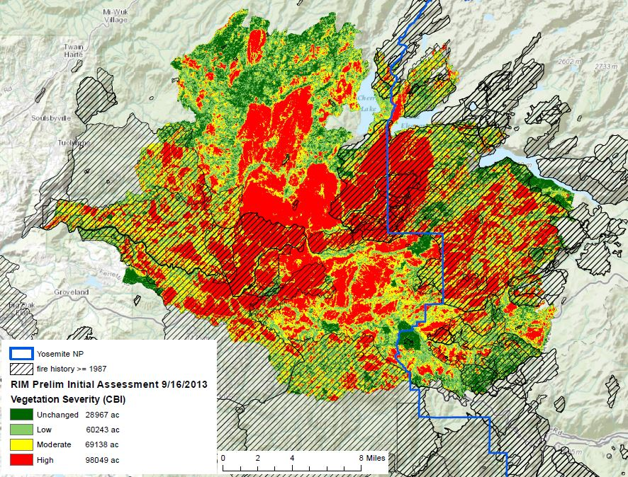

## 1.1&nbsp;&nbsp;&nbsp;&nbsp;What is Burn Severity?

The most widespread spectral index for identifying burned areas and fire severity levels is the Normalized Burn Ratio, 

(add image or equation)

NBR = (NIR-SWIR)(NIR+SWIR) and with Landsat this is NBR = (Band 5 - Band 7)(Band 5 + Band 7).
The near-infrared band (NIR) is sensitive to chlorophyll present in live vegetation, while the short-wave infrared band (SWIR) is primarily sensitive to water content in soil and vegetation. It has also been shown to be capable of discerning dead wood from burned soil, ash, and charred wood. As a result, NBR is sensitive to absolute changes in live, photosynthetically active vegetation, moisture content, and certain post-fire surface conditions. [3] 

<figure class="image" align="center">
  
  <figcaption align="center">Reflectance of NIR, SWIR for burned and unburned areas </figcaption>
</figure>

To produce a burn severity map, optimal pre and post fire images are selected based on their proximity to a fire and the presence of environmental factors that reduce image quality, like clouds, smoke, and snow. NBR is then calculated for both images and the resulting images are differenced to get dNBR. Burn severity classifications are then produced by having an analyst subjectively determine thresholds based on histogram analysis.

(ADD FIGURE)

However in regions that are less vegetated (grassland, shrubs) or have heterogeneous land cover types, dNBR can underestimate burn severity since it is a measure of absolute change. For example in the figure below, forests A and B experience near total vegetation loss from fire and should both be classified as a high severity burn. However since forest A has less pre-fire vegetation than forest B, its dNBR value is much lower and its burn severity would be equivalent to the fire in forest C. This leads to an underestimation of burn severity and can skew the results of fire severity maps. A relativized version of dNBR, rdNBR, has been shown to perform better in regions that are less vegetated and have heterogenous vegetation types, but its use is not as widespread as dNBR.

<figure class="image" align="center">
  
  <figcaption align="center"></figcaption>
</figure>

## Federal Fire Mapping Groups
The main groups responsible for mapping fires in the US are MTBS, RAVG, and BAER. MTBS is the largest and most active federal mapping group and in California it maps fires larger than 5000 acres. RAVG maps fires that occur on at least 1000 acres of National Forest System (NFS) land and produces results usually within 60 days of fire containment. It specifically focuses on changes in canopy cover and basal area. BAER is slightly different since its main goal is to assess soil burn severity and identify and prescribe treatments for any hazards caused by fire, like water runoff from hydrophobic soil. Within a week of a fire’s containment it provides satellite imagery and preliminary burn severity data to field teams, made up of ecologists, soil scientists, and engineers, that work in the field to stabilize a region. [7]

The biggest issues with burn severity maps produced by these groups are that

Several issues currently hinder the effectiveness of burn severity maps produced by these groups.

The first is that the completeness of wildfire mapping methods is insufficient. Due to various agency requirements, lack of resources, and the immense number of wildfires every year, federal agencies are only able to map a fraction of wildfires. This leads to lacking fire documentation and coverage, which could limit the work of groups that depend on fire severity maps. In the ten year span from the 2010-2019 fire seasons RAVG mapped 142 fires, MTBS mapped 424 fires, and BAER mapped 174 fires. In addition there is a lack of “completeness” in the data used to produce fire severity maps. Only two spectral bands, NIR and SWIR, are used from Landsat to calculate dNBR and contextual data like land cover or weather is not used. This additional data could contain relevant information that can be uncovered with machine learning.

The second issue relates to the consistency of severity maps. Maps produced by MTBS rely on analysts to subjectively determine dNBR thresholds to produce severity classifications. In addition, these thresholds are not validated with field data or ecologically quantified so the consistency of their maps is questionable. [7] 
Another source of inconsistency is the use of different pre and post fire images since these agencies mostly operate independently and on different timelines. Ideally, the selected pre and post fire images are as close to a fire as possible because using images that are further apart can influence results. For example, selecting a post fire image from a later date allows vegetation regrowth from fire or seasonal changes in vegetation to occur. Or if a fire occurs in November but a pre-fire image from spring is used, this can increase a fire’s dNBR value since the absolute decrease in vegetation is greater. [8] For these reasons, agencies often come up with conflicting results. The Rim Fire burned 250,000 acres near Yosemite and was one of the most destructive wildfires in state history in 2013. The fire severity map produced by RAVG showed that 88% of the area was burned, while the soil burn severity map by BAER showed 56% of the land was unchanged or had a low severity burn. 

  

    
  

  

    
  

The third issue, which only affects MTBS, is the speed at which severity maps are produced. They release maps on a two year lag and as of today still have not released any for fires from the 2020 and 2021 fire seasons. This delay is likely due to the large number of fires they are responsible for and the amount of human influence required.
