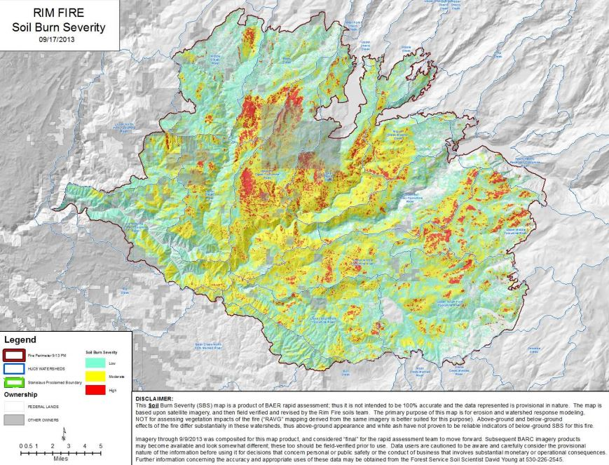

## 2.1&nbsp;&nbsp;&nbsp;&nbsp;Fire and Image Selection

(add details)

<figure class="image" align="center">
  
  <figcaption align="center">17 selected fires with bounding boxes </figcaption>
</figure>

<figure class="image" align="center">
  
  <figcaption align="center">17 selected fires with bounding boxes </figcaption>
</figure>

<figure class="image" align="center">
  
  <figcaption align="center">17 selected fires with bounding boxes </figcaption>
</figure>

## 1
<figure class="image" align="center">

  

    
  

  

    
  

<figcaption align="center>sdfspdomovf</figcaption>
</figure>

## 2

<figure class="image" align="center">
  

    
  

  

    
  

  <figcaption align="center>sdfspdomovf</figcaption>
</figure>

