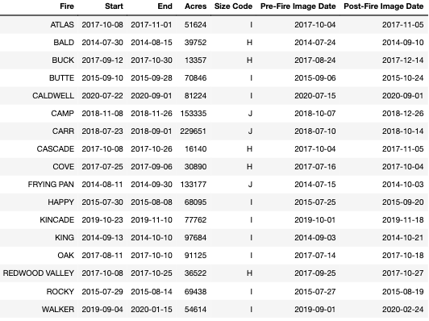

## 2.1&nbsp;&nbsp;&nbsp;&nbsp;Fire and Image Selection

(add details)

<figure class="image" align="center">

  

    
  

  

    
  

	<figcaption align="center">Location and data of 17 selected fires </figcaption>
</figure>

<figure class="image" align="center">
  
  <figcaption align="center">California's land cover </figcaption>
</figure>

